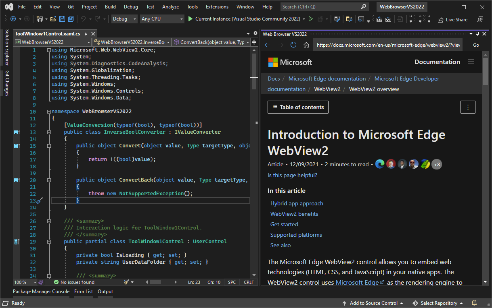
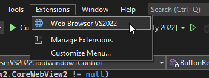
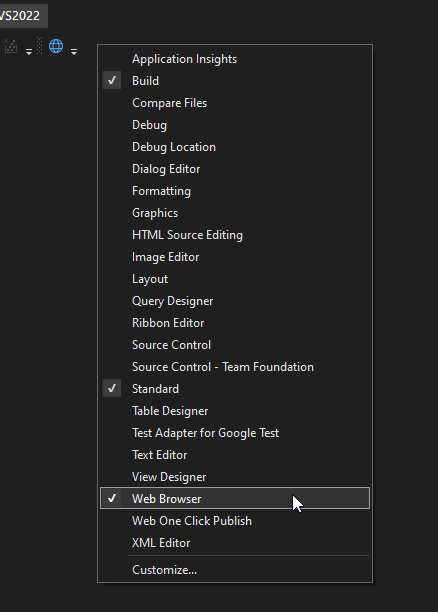
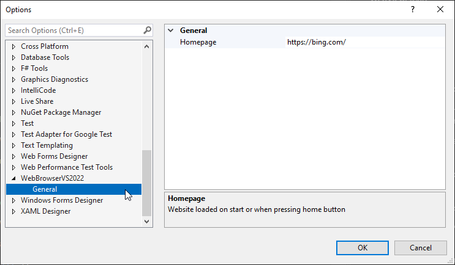

Web Browser for Visual Studio 2022
----------------------------------

In Visual Studio 2022 the built in Web Browser was deprecated
[(link)](https://docs.microsoft.com/en-us/visualstudio/ide/reference/web-browser-environment-options-dialog-box?view=vs-2022).

This extension restores some of this functionality.
It uses Microsoft Edge WebView2 to render websites.

Browser user data is located in `%TEMP%\WebBrowserVS2022_UserData\`

!!! IMPORTANT NOTE !!!
----------------------
**This extension require a lot of resources to run and might make Visual Studio unstable!**

Preview
-------

How to Open Browser
-------------------
To open the browser navigate to menu: Extensions -> Web Browser VS2022

How to Add to toolbar
---------------------
Add to toolbar: right click on toolbar -> Web Browser

How to Change homepage
----------------------
To change homepage navigate to Tools -> Options -> Web Browser VS2022 -> General

License
-------
MIT License
